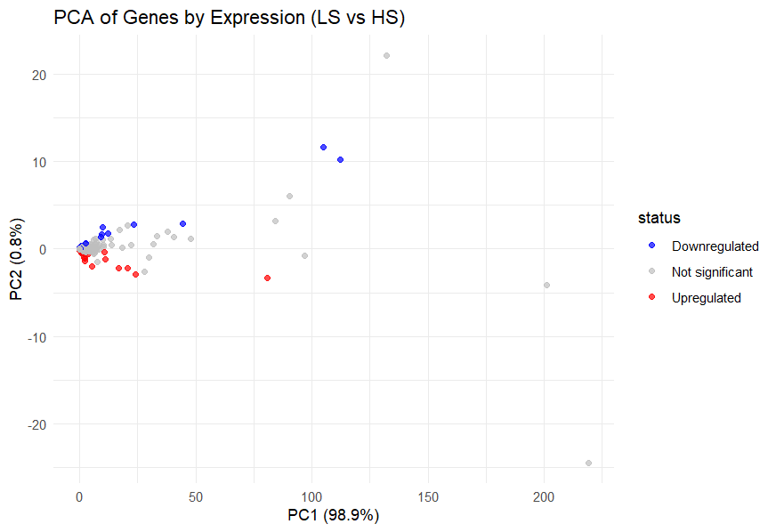
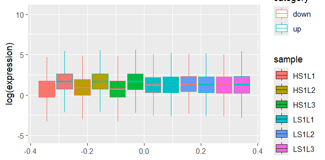
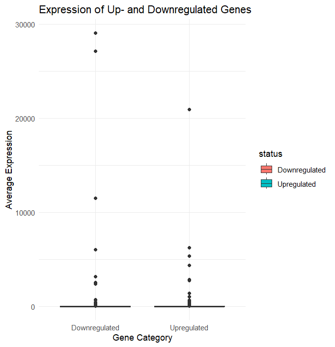
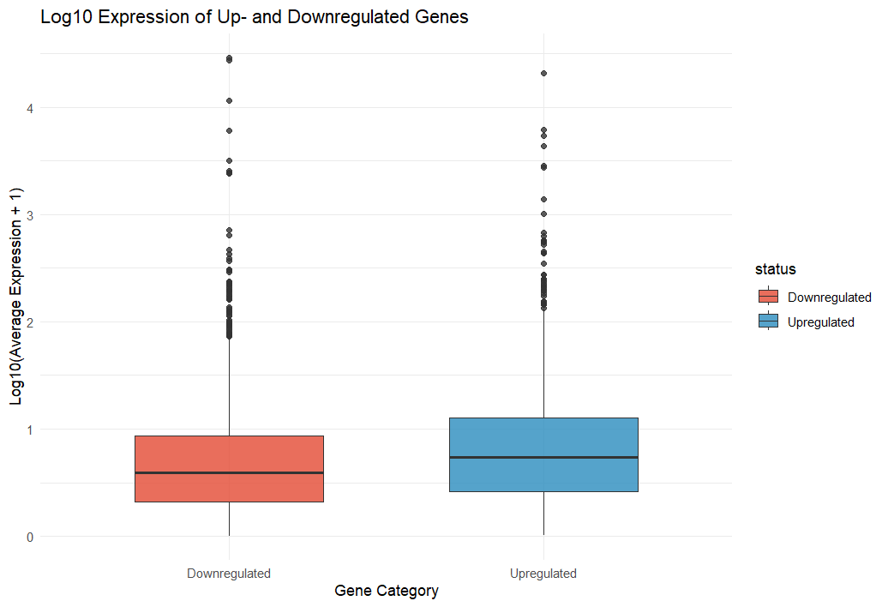
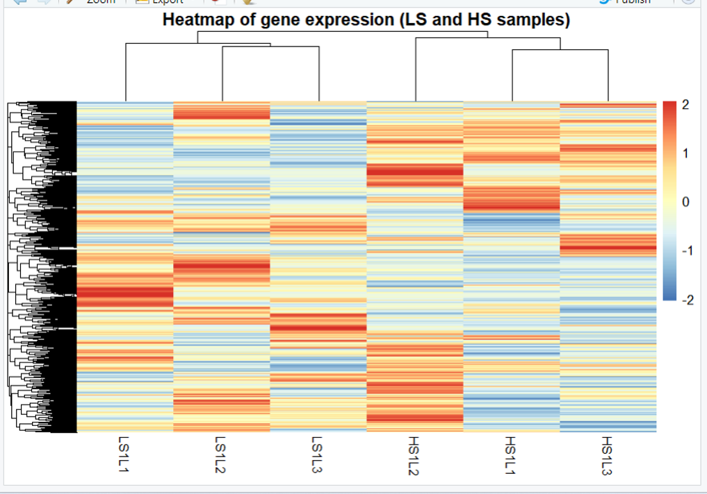
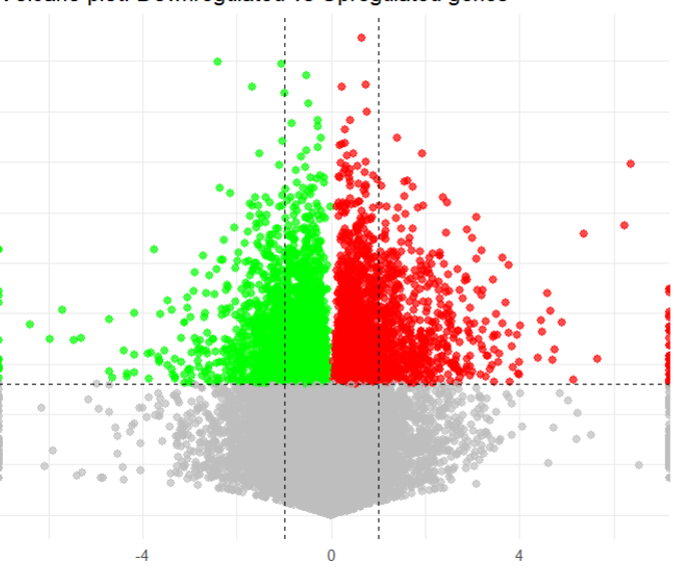

# differential-gene-expression-R
Gene expression profiling (LS vs HS samples) using Tidyverse. Includes paired t-tests, fold change calculation, and visualization via Volcano plots and Boxplots.

# Differential Gene Expression Analysis (DGE)

This project identifies genes that are significantly up- or down-regulated under different stress conditions (Low Stress vs. High Stress).

## Methodology
1. **Data Normalization:** Converting raw expression data to numeric formats and handling missing values.
2. **Statistical Sieve:** Applying **paired t-tests** to calculate significance (p-value).
3. **Biological Significance:** Calculating **Log Fold Change (LFC)** to determine the magnitude of change.
4. **Classification:** Genes are categorized into `Upregulated`, `Downregulated`, or `Not Significant` (p < 0.05).

📂 Нажми, чтобы увидеть все графики анализа

##  Tech Stack
* **R / Tidyverse** (dplyr, ggplot2, tidyr)
* **Statistical Methods:** Paired t-test, Log transformation.

Data Preprocessing: The pipeline includes a specialized step to handle raw CSV files with placeholder columns (double-comma delimiters), ensuring clean data mapping before statistical computation.
